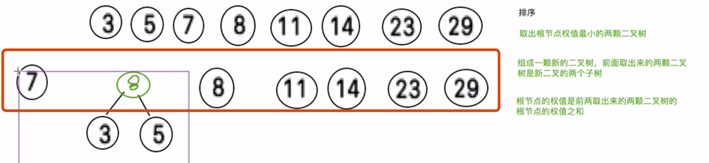
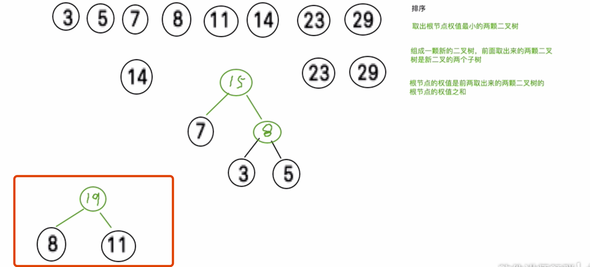

#### 树
> 前面的 chapt02 和 03 了解了一些数据结构，根据其实现方式，这些数据结构可以划分为2种类型
* 基于数组的实现 VS 基于链表的实现
> 就对于效率而言，两种方式各有长短，具体而言，基于数组的实现的结构允许我们通过下标在常数的时间内找到目标对象
> 并读取内容，但是一旦对其发生修改，那么无论插入或者删除都需要消耗线性的时间。
> 
> 对于链表的实现允许我们借助引用或者位置对象，在常数的时间内插入或者删除元素，但是为了找出居于特定次序的元素，
> 不得不话费线性的时间对整个结构进行遍历查找。
>
> 从更广的角度来看，此前加上的结构都是属于所谓的线性结构，也就是各个元素之间存在一个自然的线性次序，存在之间后继
> 或者前驱的线程次序
>

> 但是树模型就不存在这一的次序，树结构属于非线性次序，当然只要加上某种约束，就能在树结构的元素之间确定某种线性次序，
> 所以树结构可以成为非线性结构，或者半线性结构。
> 
> 就其内部组成而言，树是一种分层结构，树结构之所以在算法理论和实际使用中占据着关键的角色，并且有着不计期数的变种

* 树的一些概念
> 定义四.1 在树结构中，
    每个节点的深度都是一个非负整数;
    深度为0的节点有且仅有一个，称作树根(Root);
    对于深度为 k (k≥1)的每个节点 u，都有且仅有一个深度为 k-1 的节点 v 与之对应，称作 u 的父 亲(Parent)或父节点。
  
> 定义四.2 若节点v是节点u的父亲，则u称作v的孩子(Child)，并在二者之间建立一条树边(Edge)。
> 定义四.3 树中所有节点的最大深度，称作树的深度或高度。
> 结论四.1 树中节点的数目，总是等于边数加一。
>   就渐进复杂度而言，树中边的总数与节点的总数相当。

> 定义四.4 任一节点的孩子数目，称作它的“度”(Degree)。
> 每个内部节点均为 m 度的有序树，称作 m 叉树。
> 定义四.5 至少拥有一个孩子的节点称作“内部节点”(Internal node);没有任何孩子的节点则称作 “外部节点”(External node)或“叶子”(Leaf)。
> 定义四.6 由树中 k+1 节点通过树边首尾衔接而构成的序列{ (v0, v1), (v1, v2), ..., (vk-1, vk) | k ≥ 0}，称 作树中长度为 k 的一条路径(Path)。
 
> 如上图{ (p, l), (l, f), (f, b), (b, a), (a, d), (d, h), (h, n) }构成了一条联接于节点p和n之间、长度为 7 的路径。
>
> 观察结论四.2 树中任何两个节点之间都存在唯一的一条路径。
    这就意味着，树既是连通的，同时又不致出现环路
> 观察结论四.3 若v是u的父亲，则depth(v)+1=depth(u)。
> 从树根通往任一节点的路径长度，恰好等于该节点的深度。

> 定义四.15 每个节点均不超过 2 度的有序树，称作二叉树(Binary tree)。二叉树是最简单的非平凡 m 叉树，但却是讨论最多、应用最广的。
>  在二叉树中，深度为k的节点不超过2k个。
>  高度为 h 的二叉树最多包含 2h+1-1 个节点。

> 若二叉树 T 中所有叶子的深度完全相同，则称之为满二叉树(Full binary tree)。
> 若在一棵满二叉树中，从最右侧起将相邻的若干匹叶子节点摘除掉，则得到的二叉树称 作完全二叉树(Complete binary tree)。

> 父亲-长子-弟弟模型

>
* 树的遍历
> 前序遍历：根结点 ---> 左子树 ---> 右子树
> 中序遍历：左子树---> 根结点 ---> 右子树
> 后序遍历：左子树 ---> 右子树 ---> 根结点
> 层次遍历：只需按层次遍历即可

>
> 前序遍历：1  2  4  5  7  8  3  6\
> 中序遍历：4  2  7  5  8  1  3  6\
> 后序遍历：4  7  8  5  2  6  3  1\
> 层次遍历：1  2  3  4  5  6  7  8

* 二叉树的基本算法
> getSize()、getHeight()和 getDepth()
> 分别返回二叉子树的规模、树根节点的高度和深度。

> updateSize()
> 若当前节点的孩子发生变化，比如原有的某个孩子被删除或者有新的孩子插入，就需要更新当 前节点及其祖先的规模记录，以便后续的查询，
> 允许直接对任何节点执行这一操作。

> 因此，一旦其左、右子树的规模都已确定，我们就可以在O(1)时间内得到以节点v为根的子树规 模。当然，
> 此后还需要从v出发沿parent引用逆行向上，依次更新各个祖先的规模记录。

> updateHeight()
> 在孩子发生变化后，也有必要更新当前节点的高度记录。
> 只需读出左、右孩子的高度，取二者中的大者，再计入当前节点本身，就 得到了当前节点v的新高度。

> 直接前驱、直接后继的定位（根据中序排序后的node找到直接前驱、直接后继）
> “左(右)子树必须 完全居于根节点的(左)右侧”，则所有节点在水平轴上投影的自左向右次序，恰好与中序遍历序列 的次序吻合。
> 从这个意义上说，中序遍历就是按照自左向右的次序访问各个节点。

> 观察结论四.14二叉树中，除中序遍历序列中的首节点外，任一节点 v 的直接前驱 u 不外乎三种可能: \
> v 没有左孩子，同时 v 是右孩子:此时，u 就是 v 的父亲节点; \
> v 没有左孩子，同时 v 是左孩子:此时，从 v 出发沿 parent 引用逆行向上，直到第一个是右孩子 的节点 w，则 u 就是 w 的父亲节点;\
> v 有左孩子: 此时，从 v 的左孩子出发，沿 rChild 引用不断下行，最后一个(没有右孩子的)节 点就是 u。\

> 前驱结点：节点val值小于该节点val值并且值最大的节点
> 后继节点：节点val值大于该节点val值并且值最小的节点

完全二叉树（Complete Binary Tree）：深度为 h，有 n 个节点的二叉树，当且仅当其每一个节点都与深度为 h 的满二叉树中，序号为 1 至 n 的节点对应时，称之为完全二叉树。
如图如果将5或者6或者7删除，那么就不是完全二插树了(倒数自二层右层不连续了)，完全二叉树的节点都在最后一层或者倒数第二层中，最后一层的叶子节点在左边连续
倒数第二层的叶子节点在右边连续

满二叉树（Full Binary Tree）：一棵深度为 h，且有 2h - 1 个节点称之为满二叉树。

第n个节点的左子节点 2*n + 1
第n个节点的右子节点 2*n + 2
第n个节点的父节点 (n-1)/2

旋转后重新获得平衡

在 AVL 树中插入节点 x 后，若 g(x)是失衡的最低节点，则经过上述单旋或双旋调整 之后，不仅能使局部重新平衡同时高度也复原，而且整棵树也将重获平衡。
在 AVL 树中插入一个节点后，至多只需经过两次旋转即可使之恢复平衡。

**高度**： 最大的层数

**森林** 多颗子树生成的

#### 霍夫曼树
它是n个带权叶子节点构成的所有二叉树中，带权路径长度最小的二叉树。
带权路径长度

如图，a树中A叶子节点的权重为9，从更节点到这个节点经过2个节点，所以A叶子节点的
带权路径为2*9=18

树的带权路径长度：WPL(weighted oath length): 树中所有叶子节点的带权路径长度之和
如截图中同一棵树，有三种构成方式，三种WPL分别为：
(9+4+5+2) * 2 = 40
9 + 5*2+4*3+2*3 = 9+10+18=37
4+2*2+(5+9)*3=4+4+42=50
构建HFM树的时候
1. 将权值越大的点放到离根节点越近的地方，所以应该先对数组进行排序
2. 将每一个值创建为一个Node
3. 先取出最小的2个值，组成新的一颗二叉树的子树，父节点的权重是这2个子树的权值之和。
4. 然后将父节点加入到数组，重新排序

排序结果

5.然后将最小的2棵树取出来作为2个子节点，组成一个二叉树，且父节点的权重为2个子节点的和
6. 然后在计算新父节点权重，重新排序

然后依次操作

所有的数组中的值，都变为了霍夫曼树中的叶子节点
经过以上的操作，权值比较小的都会在叶子节点下侧，而权值比较大的都会在
较接近root节点

如右图左侧是一颗hfm 树，叶子节点是要编码的句子，句子按照每个字母的频率split
然后将字母和频率绑定在一起作为hfm树的权重。

然后hfm 树路径左侧为0，右侧为1，作为路径，一个叶子节点的路径就是其权值的编码结果，如图右侧。

计算机在传输的过程中就算将所有编码后的值放在一起也不会出现错意。
也就是说r的编码为111 a的编码为10，将二者拼接在一起的结果 11110，
那么在整个hfm树中不会出现编码为1111或者11110的字母
也就是使用hfm树编码，编码的结果都是唯一的，不会出现上述错意的情况

#### 平衡二叉树 AVL树
任何一个节点的左子树和右子树的高度差的绝对值不超过1

平衡二叉树 的前提是这棵树是一个二叉排序树

平衡二叉树主要是保证二叉排序树的搜索效率

#### 2-3 树
有2个子节点的叫二节点
有3个子节点的叫三节点

二节点要么有2个子节点，要么没有子节点
三节点要么有2个子节点，要么没有子节点

#### 2-3-4 节点
就是有4个节点或者没有节点

