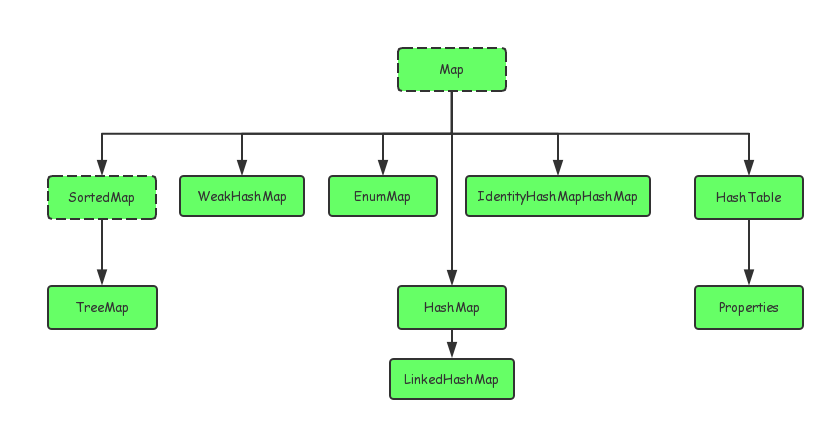

 #### 散列表
散列表由两个要素构成:桶数组（Bucket array）与散列函数

桶数组：
其实就是一个容量为 N 的普通数组 A[0..N-1]，只不过 在这里，我们将其中的每个单元都想象为一个“桶”(Bucket)，每个桶单元里都可以存放一个条目

我们需要某一函数：
将任意关键码转换为介于 0 与 N-1 之间的整数⎯⎯这个函数 就是所谓的散列函数(Hash function)。

为了将散列技术推广至一般类型的关键码，我们需要借助散列函数 h，将关键码 key 映射为一个整数h(key) ∈[0..N-1]，
并将对应的条目存放至第h(key)号桶内，其中N为桶数组的容 量。如果将桶数组记作 A[]，这一技术就可以总结为“将条目 
e = (key, value)存放至 A[h(key)]中”。 反过来，为了查找关键码为 key 的条目，只需取出桶单元 A[h(key)]中存放的对象。因此，h(key)也 被称作 e 的散列地址。

还需要满足另一个条件⎯⎯h()是一个单射，即不同的关键码key1 ≠ key2 必然对应于不同的散列地址h(key1) ≠ h(key2) 而在实际中这个条件很难达到要求
也就是容易发生冲突（Collision）。

解决方法就是选择一个函数，让这个函数发生冲突的概率变小
x
Java 的通用类 Object 提供了一个默认的散列码转换方法 hashCode()，利用它可以将任意对象 实例映射为“代表”该对象的某个整数。
具体来说，hashCode()方法的返回值是一个 32 位 int 型整 数。通常，这一方法会被 Java 中的每个对象继承。
实际上，这一默认 hashCode()方法所返回的不过就是对象在**内存中的存储地址**。遗憾的是，这一看似再自然不过的方法，
实际上存在着严重的缺陷，因此我们在使用时需格外小心。

但是在Java 的string类型上将变得不可用，完全相同的string 变量由于内存地址的不一样，导致hashcode 函数运算之后的结果也会不一样
实际上，在实现 String 类时，Java 已经将 Object 类的 hashCode()方法改写为一种更加适 宜于字符串关键码的方法。

不同类型变量，基础类型或者装箱类型，都有其对应的hashcode 方法

双散列(Double hashing)
双散列也是克服条目堆积现象的一种有效办法。为此我们需要选取一个二级散列函数 g()，一旦
在插入 e = (key, value)时发现 A[h(key)]已被占用，则不断尝试 A[h(key) + j×g(key)]，j = 1, 2, ...。 
显然，对任何关键码 key，函数值 g(key)都不能为零⎯⎯否则就会在“原地踏步”。通常，若散
列表长度为素数 N，则取另一素数 q < N，并取 g(key) = q - (key mod q)
为了尽可能地使关键码均匀分布，可以通过实验统计确定最佳的 q 值。

装填因子
也就是当填入的数据的个数和总共能容纳下个数的比值，λ = n/N，如果 λ > 1那么也就是赛进去的个数大于可容纳的个数，
那么冲突是一定会发生的，所以有这个装填因子，一般需要λ < 0.9，如果不满足则应该填充可容纳

```java
private void rehash() {
Iterator it = this.entries();
    N = p(N<<1);
    A = new Map[N];//桶数组容量至少加倍
    for (int i=0; i<N; i++) A[i] = new Map_DLNode(T);//为每个桶分配一个子映射
         while (it.hasNext()) {//将其对应的映射结构中的
            Entry e = (Entry)it.getNext();//各条目逐一取出，将其 Object k = e.getKey();//关键码和
            Object v = e.getValue();//数据对象
            A[h(k)].put(k, v);//整合为新的条目，插入对应的子映射中
       } 
}
```

#### Java 集合框架
> Java 的集合大致分为Set、List、Queue、和Map 四种体系，其中Set表示无序不可重复的，
> List 代表有序、重复的集合；Map 表示具有映射关系的集合；Java5中又增加了Queue集合。

#### 集合和数组的区别
> 数组长度在初始化的时候就指定，只能保存定长的数据，而集合可以保存数量不确定的数据，同时保存具有映射
> 关系的数据
>
> 数组元素既可以是基本类型的值，也可以是对象。 集合中只能保存对象(实际上保存对象的引用变量)，
> 基本数据类型的变量要转换为包装类才能放到集合类中
>
#### Java 集合类之间的集成关系
> Java 的集合类主要有两个接口派生而出：Collection 和 Map

 

HashMap: 不保证插入元素的次序，TreeMap 可以保证

(1) HashMap：它根据键的hashCode值存储数据，大多数情况下可以直接定位到它的值，因而具有很快的访问速度，但遍历顺序却是不确定的。 HashMap最多只允许一条记录的键为null，允许多条记录的值为null。HashMap非线程安全，即任一时刻可以有多个线程同时写HashMap，可能会导致数据的不一致。如果需要满足线程安全，可以用 Collections的synchronizedMap方法使HashMap具有线程安全的能力，或者使用ConcurrentHashMap。

(2) Hashtable：Hashtable是遗留类，很多映射的常用功能与HashMap类似，不同的是它承自Dictionary类，并且是线程安全的，任一时间只有一个线程能写Hashtable，并发性不如ConcurrentHashMap，因为ConcurrentHashMap引入了分段锁。Hashtable不建议在新代码中使用，不需要线程安全的场合可以用HashMap替换，需要线程安全的场合可以用ConcurrentHashMap替换。

(3) LinkedHashMap：LinkedHashMap是HashMap的一个子类，保存了记录的插入顺序，在用Iterator遍历LinkedHashMap时，先得到的记录肯定是先插入的，也可以在构造时带参数，按照访问次序排序。

(4) TreeMap：TreeMap实现SortedMap接口，能够把它保存的记录根据键排序，默认是按键值的升序排序，也可以指定排序的比较器，当用Iterator遍历TreeMap时，得到的记录是排过序的。如果使用排序的映射，建议使用TreeMap。在使用TreeMap时，key必须实现Comparable接口或者在构造TreeMap传入自定义的Comparator，否则会在运行时抛出java.lang.ClassCastException类型的异常。

对于上述四种Map类型的类，要求映射中的key是不可变对象。不可变对象是该对象在创建后它的哈希值不会被改变。如果对象的哈希值发生变化，Map对象很可能就定位不到映射的位置了。

public class HashMap<K,V> extends AbstractMap<K,V>
    implements Map<K,V>, Cloneable, Serializable 
    


