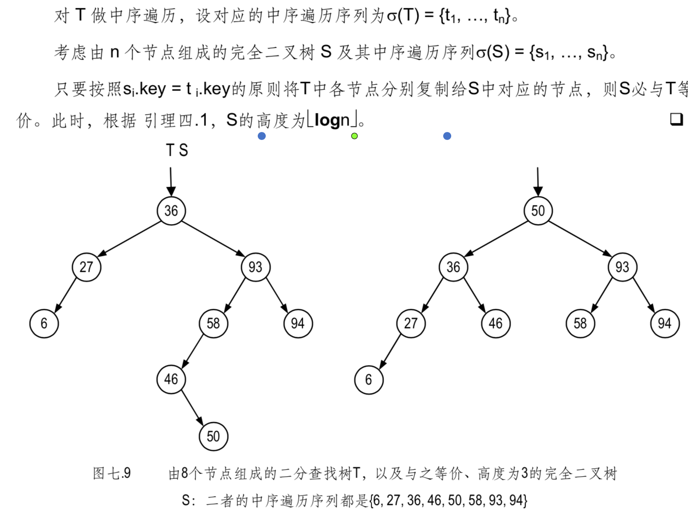

#### AVL树
平衡二分查找树（AVL树）：
二分查找树的高度越低越好⎯⎯从树的形态来看，也就是使树尽可能平衡

等价二分查找树：
中序遍历序列相同的任意两棵二叉树，称作相互“等价的”。
 

平衡因子：
在二分查找树中，任一节点 v 的平衡因子都定义为“其右、右子树的高度差”，记作 
balFac(v) = height(lc(v)) - height(rc(v))

在二分查找树T中，若所有节点的平衡因子的绝对值均不超过 1，则称T为一棵AVL树

高度为 h 的 AVL 树，至少包含 Fib(h+3) - 1 个节点。
