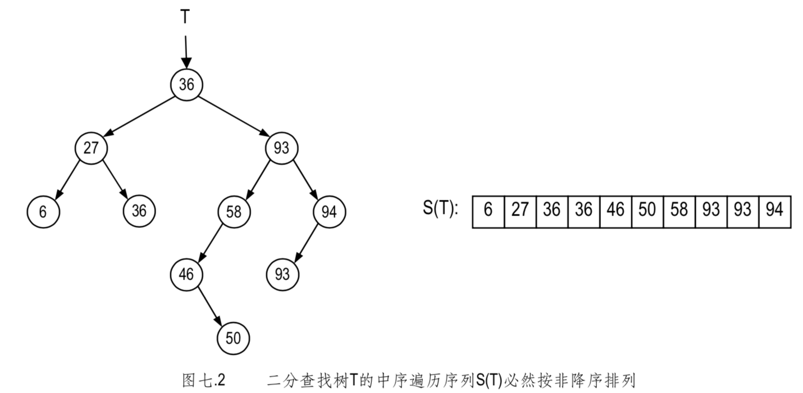
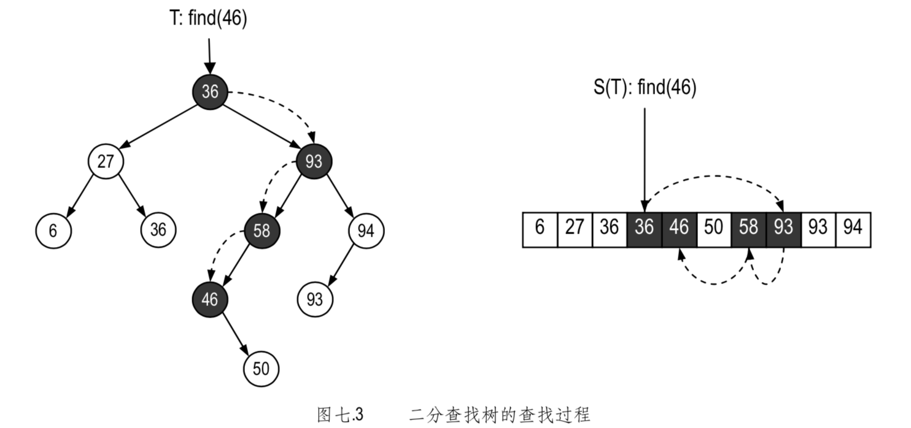
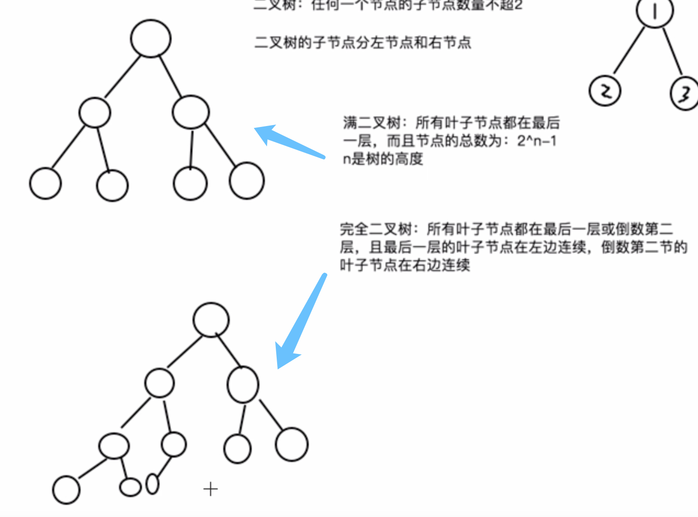
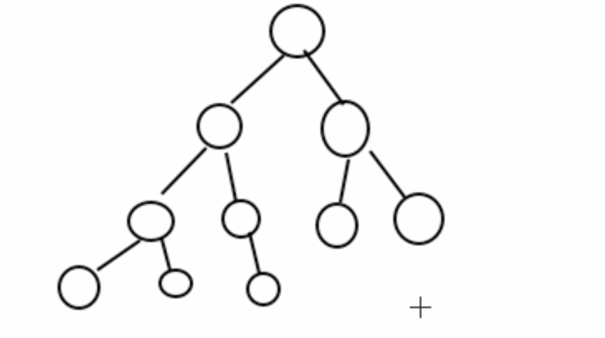

#### 二分查找树
所谓的一棵二分查找树(Binary search tree)T，要么是一棵空树，要么是以 r = (key, value) 
为根节点的二叉树，而且其左、右子树都是二分查找树，同时
在 r 的左子树中，所有节点(如果存在的话)的关键码均不大于(小于等于) key;
在 r 的右子树中，所有节点(如果存在的话)的关键码均不小于(大于等于) key。
 

**二叉树 T 为二分查找树，当且仅当其中序遍历序列是单调非降的。**

查找元素
 
在查找的过程中，递归每一层，一旦发现当前节点为null
查找失败，否则将目标关键码于当前节点的关键码做对比，于
有序查找表的二分查找过程类似，这里做如下的比较
1. 目标关键码更大(如在节点36处)，此时可以深入右树递归查找
2. 目标关键码更小(如在节点93和58处)，此时可以深入左树递归查找
3. 相等(在46处)，查找成功，结束。

当向树中插入一个新的节点时，该节点将总是作为叶子节点。所以，最困难的地方就是如何找到该节点的父节点。
如果用户在试图插入一个重复的节点。解决办法可以是直接丢弃节点 n，或者可以抛出异常。

从 BST 中删除节点比插入节点难度更大。因为删除一个非叶子节点，就必须选择其他节点来填补因删除节点所造成的树的断裂。

对于一颗二叉排序树找n次，就能覆盖 2^n 个数字，而不会像在数组或者链表中按个对比。

删除节点算法的第一步是定位要被删除的节点，接着应该选择合适的节点来代替删除节点的位置，它共有三种情况需要考虑。
1. 如果删除的节点没有右孩子，那么就选择它的左孩子来代替原来的节点。
2. 如果被删除节点的右孩子没有左孩子，那么这个右孩子被用来替换被删除节点。
3. 如果被删除节点的右孩子有左孩子，就需要用被删除节点右孩子的左子树中的最下面的节点来替换它，就是说，我们用被删除节点的右子树中最小值的节点来替换。
 
以上所有的方式都是为了保证满足最上面提到的二分查找树的性质

#### 满二叉树
所有叶子节点都在最后一层，且节点的综述为 2^n -1

#### 完全二叉树：所有叶子节点都在最后一层或者倒数第二层，且最后一层的叶子节点在
左边连续，倒数第二层的叶子节点在右边连续
 

但是如果如下图，则不是一个完全二叉树，不满足最后一层左边连续
 

