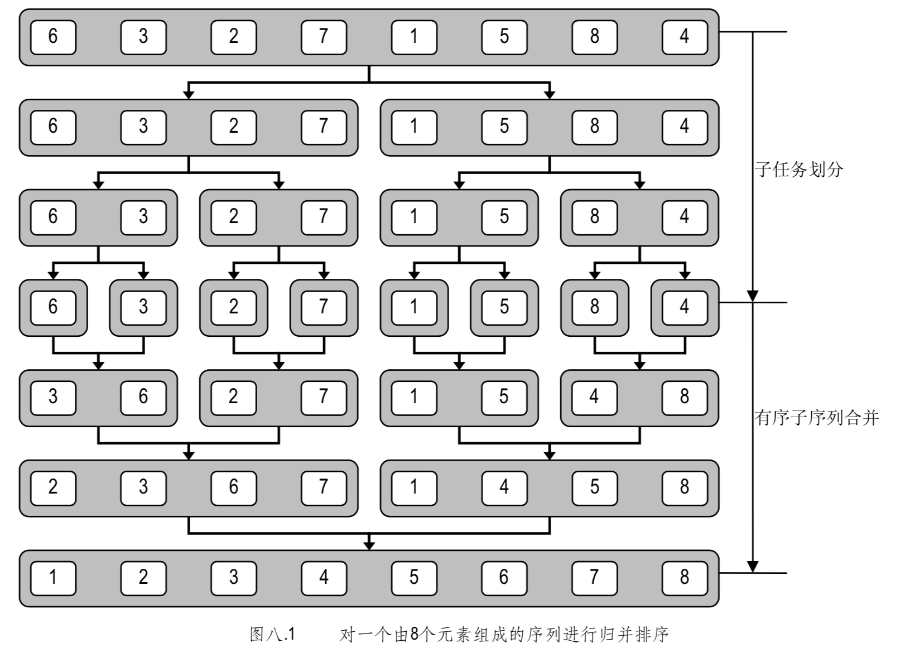

#### 排序
* 起泡
* 选择
* 插入
* 堆排序

---
**分治策略**
> 为了解决规模较大的问题，我们可以将其分解为两个子问题，并借助递归分别得到他们的解
> 然后将子问题的解合并成原问题的解
> 归并排序算法可以在 O(nlogn)的时间内对长度为 n 的序列完成排序。
> 所谓归并操作，就是将两个有序子序列合并为一个整体有序的序列
> 

* 归并(merge)排序
> 归并排序就是分治策略的典型使用

* 快速排序

