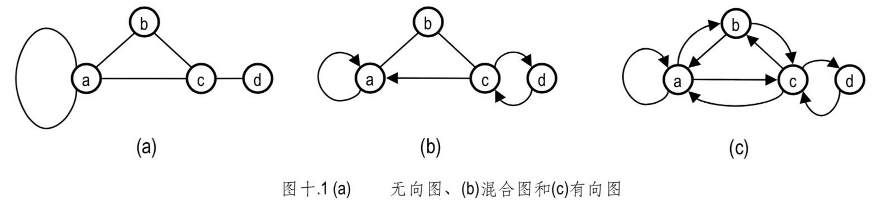
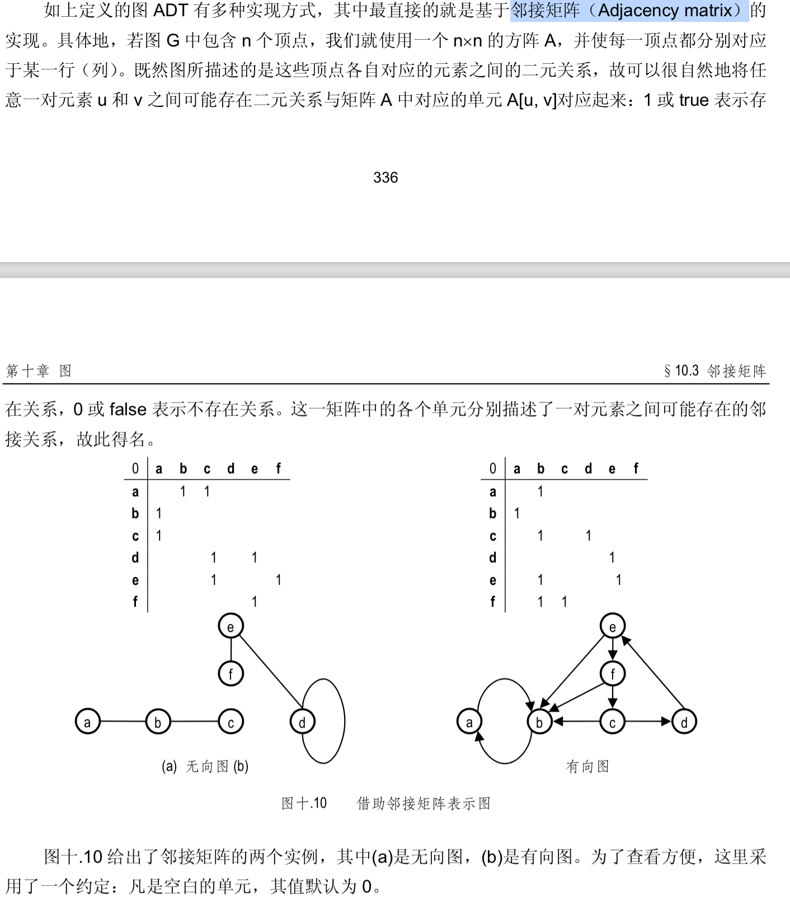

#### 图
* 无向图、混合图、有向边

> 有向图的通用性更强，因为无向图和混合图都可以转化为有向图⎯⎯如 图 十.1所示，只需将其中的每一条无向边(u, v)替换为一对有向边(u, v)和(v, u)

* 度
> 若边e = (u, v)，则顶点u和v也称作e的端点(End vertices或Endpoints)。如果e是从u指向v的 有向边，
> 则u称作起点(Origin)或尾端点(Tail)，v称作终点(Destination)或头端点(Head)。
> 我 们也称u和v是相邻的(Adjacent)，称e与v、u是相关联的(Incident)。顶点v的关联边的总数，
> 称为 v的度数(Degree)，记作deg(v)。以 图十.1(a)为例，有deg(a) = deg(c) = 3
> 在有向图中，以u为起点的有向边称作u的出边(Outgoing edge)，以v为终点的边则称作v的入 
> 边(Incoming edge )。v的出边总数称作v的出度(Out-degree)，记作outdeg(v);入边总数称作入
> 度(In-degree)，记作indeg(v)。以 图十.1(c)为例，有outdeg(a) = indeg(a) = outdeg(c) = indeg(c) = 3。

这类重复的边也称作平行边(Parallel e dges)或多重边(Multiple edges)

与某条边关联的是同一个顶点(如 图十.1 中 的顶点a)⎯⎯这样的边称作自环(Self-loop)。

相关概念查询
https://www.javazhiyin.com/35233.html

* 邻接矩阵(Adjacency matrix)

邻接矩阵的空间效率之所以低，是因为其中大量的单元所对应的边有可能 并未在图中出现，这也是静态向量结构普遍的不足

邻接表

