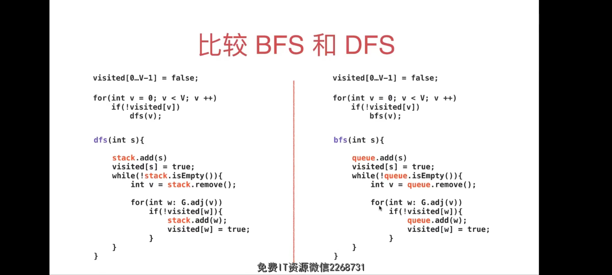
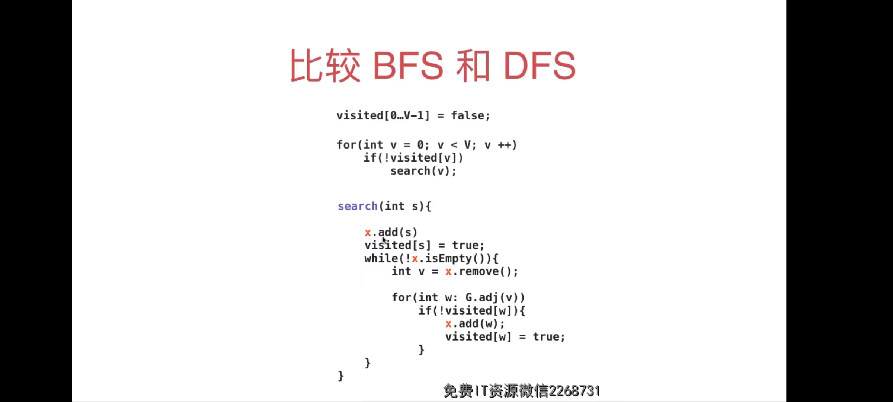

### 主要内容：

    图的表示：
        深度优先:连通性、路径、二分图检测、环的检测、floodfill
        
        广度优先：无权图的最短路径
        
        使用图论对问题建模
        
    欧拉路径
    哈密尔顿路径 状态压缩
    桥
    割点
    有向图算法： DAG, 环检测、拓扑排序、强连通分量
    最小树生成
    最短路径
    网络流    
----
----
### 概念
    定点(节点)： Vertex
    边： Edge
    无向图：undirected graph,只有边的概念
    有向图：directed graph, 边 + 方向
    无权图：边上没有信息，只表示两个点连接
    无权图：表示两个点连接，边上还还有信息
    
    根据连接是否有方向以及边是否带有信息将图分为4类：
                有权        无权
            ------------------------
     无向   - 无向有权图 - 无向无权图 -   
     有向   - 有向有权图 - 有向无权图 - 
            ------------------------  
         
    环   : 一个边从定点a出发，又回到了a定点，经过多个点
    自环边：一个边从定点a出发，又回到了a定点，不经过其他点，没有什么意义
    平行边：2个定点之间有2条边
    两点相邻，两个点有边链接
    点的邻边：一个点接触的几个边
    
    简单图：没有自环边和平行边的图称为
    
    一张图，不一定全部都连接的，会有独立顶点
    
    联通分量：几个孤岛，每个孤岛的点和点直接都是可以到达的，但是多各联通分量之间是不可到达的
    
    一个图会有多个联通分量
    
    无环图：任意一个顶底不能从自己出发然后回到自己
    有环图：任意一个顶底能从自己出发然后回到自己
    
    树是图的一种特殊情况，是一种无环图(无环图不一定都是图)
    
    (度)顶点的度：一个顶点相邻的边数
    
    定点的入度：有向图中有多少个箭头指向了顶点
    定点的出度：从该定点出发了几条边
    
    邻接矩阵：
        稠密矩阵，是一个二维矩阵，A[i][j]=1 表示顶点i和j相临，对于简单图A[i][i]=0
        对于无向图矩阵是主对角矩阵 A[i][j]=A[j][i]
---
#### 图
图数据结构和树，堆等数据结构的不同，它不是为了存储数据，一般是通过：存储一种拓扑关系，然后在这个拓扑关系中，通过
遍历发现隐藏在【拓扑关系中的关系】，如两个节点中是否关联、最短路径是多少。

很多算的本质就是 "遍历"，在遍历的过程中记录一些信息，然后输出最后信息。

图的广度优先遍历和树的层次遍历类似，同时和深度优先遍历一样，需要记录每个节点是否已经得到遍历。

广度优先遍历能够找到无权图的最短路径，因为他是以距离顺序遍历所有的点，所以遍历的结果中两点之间的距离
就是最短的路径。

图论可以是非常灵活的，遍历是解决大部分问题的本质，在遍历的过程中，记录不同的信息，
或者加入不同的逻辑，就可以解决大部分的问题。

---
#### BFS vs  DFS
使用非递归的方式写遍历
BFS
```java
   private void bfs(int s) {
        Queue<Integer> queue = new LinkedList<>();

        queue.add(s);
        visited[s] = true;

        while (!queue.isEmpty()) {
            Integer topEle = queue.remove();
            order.add(topEle);
            for (Integer adj:G.adj(topEle)) {
                if (!visited[adj]) {
                    queue.add(adj);
                    visited[adj] = true;
                }
            }
        }
    }
```
树的广度优先遍历，称为层次遍历，需要借助一个队列完成，依次将节点，以及节点的左右孩子放入到队列中
然后再队列中取出节点，那么取节点这个顺序就是树的层次遍历顺序
图的广度优先遍历和树的是一样的，需要借助队列，但是区别是需要记住每个节点是否遍历，防止重复遍历

大部分 DFS 可以解决的问题，使用图的BFS 也都可以解决。而且BFS有一个特殊的用途
由于二者算法遍历的不同，其在找点到点的连接边的结果也不一样，如bfs.jpg 所示，找 0 -> 6 的路径
bfs 得到的路径是0到6的最短路径，所以BFS的一个特殊用途就是：【找到点到点的最短路径】其遍历顺序是一层一层的
从源头开始，一层一层的往外扩散
---
DFS
```java
    private void loopDFS(int s) {
        Stack<Integer> stack = new Stack<>();
        stack.add(s);
        visited[s] = true;

        while (!stack.isEmpty()) {
            Integer topEle = stack.pop();
            for (Integer adj:G.adj(topEle)) {
                if (!visited[adj]) {
                    stack.add(adj);
                    visited[adj] = true;
                }
            }
        }
    }
```

二者的代码逻辑是一样的，唯一的区别就是数据拿出来的方式不一致，一个FIFO一个FILO

可以将二者进行统一
```java
    private void search(int s) {
        X<Integer> x = new x<>();
        x.add(s);
        visited[s] = true;

        while (!stack.isEmpty()) {
            Integer topEle = stack.pop();
            for (Integer adj:G.adj(topEle)) {
                if (!visited[adj]) {
                    x.add(adj);
                    visited[adj] = true;
                }
            }
        }
    }

```
    
#### Bridge
对于无向图，如果删除一个边，
整个联通分量数量发生变化，则这条边称为是桥
桥意味着图中最脆弱的关系
应用： 交通系统、社交网络
一个桥中可以有多条桥。
一棵树的所有边都是桥。

寻找桥的算法
    使用DFS 就可以解决，有难度，因为吉利的信息更 "多远"

##### 代码中的内容有：
1. 联通分量
2. 路径问题，单源路径
3. 环检测
4. 二分图

##### 拓展：
图同构：结构是一样的，只不过长的不一样，如图 二分图2.jpg
平面图：

#### 图论问题建模 
对问题进行建模，变为图论问题，然后再遍历过程中，添加记录不同的信息，组合不同的信息，解决问题

#### BFS vs DFS 小结
BFS: 解决无权图的最短路径
二者的联系：当都使用非递归算法的时候，二者的区别仅仅在于借助的数据结构不一样 

dfs 使用栈：先进后出
bfs 使用队列，先进先出
那么可以将借助的这个数据结构抽象出来，就可以将bfs 和 dfs 框架
出来



