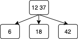
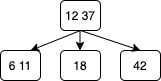
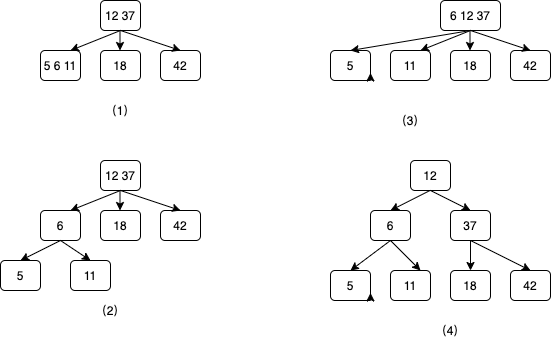
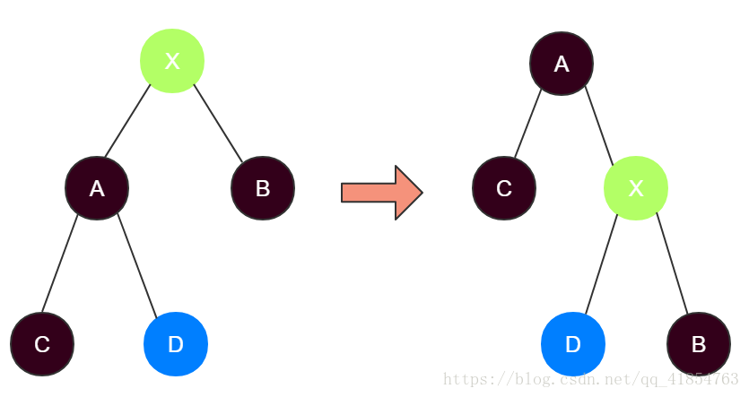
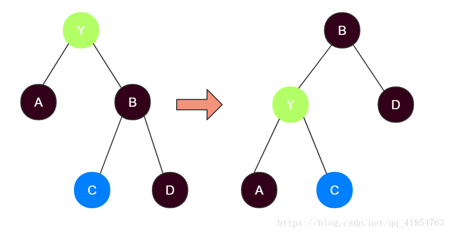
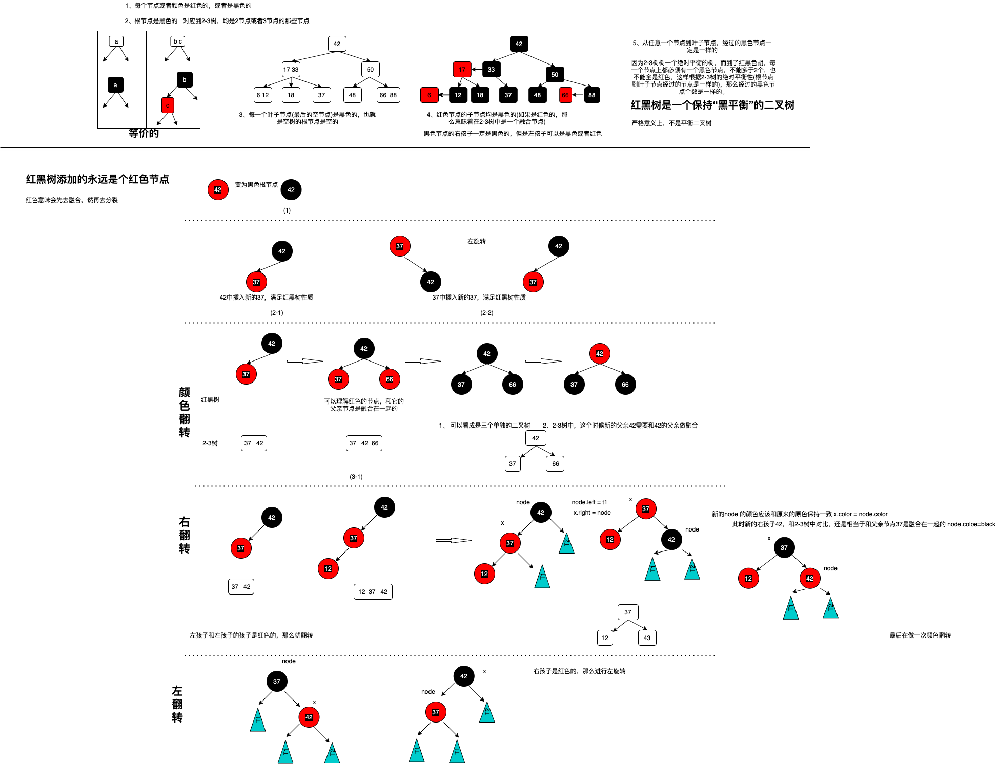

#### 2 - 3 树
学习红黑树，先来看一看 2-3树

满足二分搜索树的基本性质: 左孩子比父亲小，右孩子比父亲大

每个节点存放2个元素或者3个元素

2-3树是一种绝对平衡的树，每一个叶子节点到root 经过的节点的个数是一样的
    
    添加节点的时候永远不会添加到空的地方
        如现在只有一个42的节点，现在要插入37这个元素，因为42没有孩子所以37不会插入
        而是和42融合，且37小于42，所以这个时候还是只有一个节点，节点中有
        37/42 2个元素，那么这2个元素的节点，可以有3个孩子
        
        现在要插入12这个元素，由于现在还没有叶子节点，所以还是会做融合操作
        12/37/42 三个元素的节点，这个3个元素的节点可以有4个孩子，这个时候这3个元素的
        节点会发生分裂，分裂为 37为父亲节点，12为左孩子，42为右孩子
        那么这棵树就能保持绝对的平衡
        
        现在要插入18这个节点，18<37，所以要插入到左子树中去，然后到了12，这个元素，12没有叶子节点
        所以18和12发生融合，生成一个节点，这个节点有2个元素12/18
        
        然后在插入6这个节点，会暂时继续融入到 6/12/18 这个节点，然后这个节点在发生拆解
        这个时候的拆解和上面的就不一样了，
        1. 会将 6/12/18 拆解为 6为左孩子，12为父亲，18为右孩子
            但是这个时候左边的高度是比右边的高的
        2. 父亲12 会和 12的父亲进行融合，然后就形成了12和37这个融合节点，然后这个节点由3个孩子
            分别为 6、18、42
            这个时候就是一个绝对平衡的状态了
   
   
        3. 插入11，然后得到下面的树     
   
        
        4. 插入5，过程如下，经过中间的几种中间态，一些变形之后就生成了一个绝对平衡的树
   
   
        这里的例子是一红极端的情况始终插入最小的值，如果是二插搜索树，那么就会退化为一个链表
        上述的第2步骤的时候，打破了平衡，这个时候父亲节点和父亲的父亲进行融合
   
#### 颜色翻转、右旋转
   
            
---
红黑树与AVL树的比较：
1.AVL树的时间复杂度虽然优于红黑树，但是对于现在的计算机，cpu太快，可以忽略性能差异
2.红黑树的插入删除比AVL树更便于控制操作
3.红黑树整体性能略优于AVL树（红黑树旋转情况少于AVL树）

其中两款具有代表性的平衡树分别为AVL树和红黑树。AVL树由于实现比较复杂，
而且插入和删除性能差，在实际环境下的应用不如红黑树。

它一种特殊的二叉查找树。红黑树的每个节点上都有存储位表示节点的颜色，
可以是红(Red)或黑(Black)。

红黑树是一棵二叉搜索树，它在每个节点增加了一个存储位记录节点的颜色，
可以是RED,也可以是BLACK；通过任意一条从根到叶子简单路径上颜色的约束，
红黑树保证最长路径不超过最短路径的二倍，因而近似平衡。

每个节点颜色不是黑色，就是红色根节点是黑色的
如果一个节点是红色，那么它的两个子节点就是黑色的（没有连续的红节点）
对于每个节点，从该节点到其后代叶节点的简单路径上，均包含相同数目的黑色节点
---
[博客](https://blog.csdn.net/qq_41854763/article/details/82694873)

[美团的技术博客](https://zhuanlan.zhihu.com/p/24367771)
* 红黑树本身并不复杂，只是在插入删除的时候情况比较多

红黑树是一颗二叉查找树，且具有如下特性：

    (1) 每个节点或者是黑色，或者是红色。

    (2) 根节点是黑色。

    (3) 每个叶子节点(最后的空节点)是黑色。

    (4) 如果一个节点是红色的，则它的子节点必须是黑色的。(不能出现连续的红色)

    (5) 从一个节点到该节点的子孙节点的所有路径上包含相同数目的黑色节点

通过上面的定义:

可以看到红黑树本质上还是一颗二叉查找树，所以，对红黑树的插入删除操作都可以分为两阶段来完成，

1. 将红黑树看成一颗普通的二叉查找树完成插入删除操作

2. 通过旋转以及颜色调整来使得操作后的树满足红黑树的所有特性即可。

#### 旋转操作

##### 左旋转
对x点进行右旋：

对y点进行左旋：

    
**note:** 注意三个操作的条件
1. 左旋转：node 的右孩子是红色的
2. 右旋转：node 的左孩子和左孩子的孩子是红色的
3. 改变颜色：node 的左孩子和右孩子都是红色的
 
        
    

