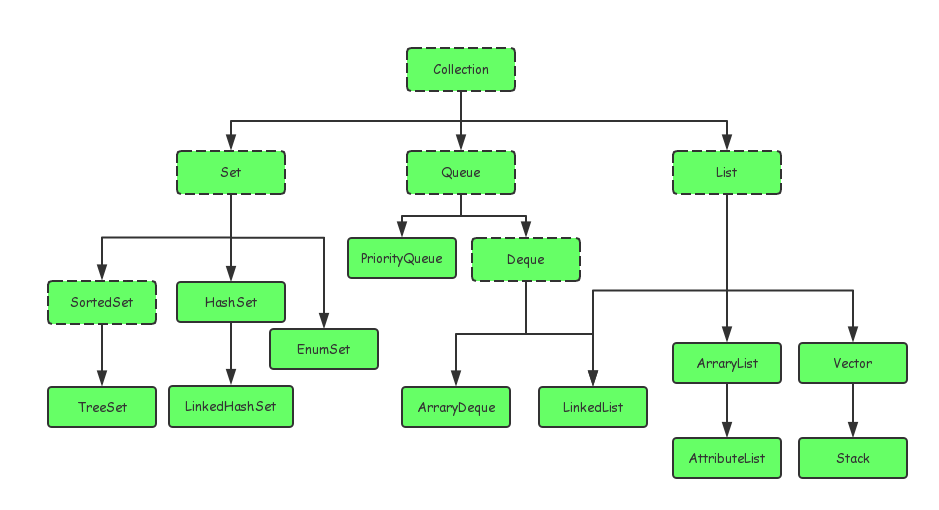

#### Java 集合框架
> Java 的集合大致分为Set、List、Queue、和Map 四种体系，其中Set表示无序不可重复的，
> List 代表有序、重复的集合；Map 表示具有映射关系的集合；Java5中又增加了Queue集合。

#### 集合和数组的区别
> 数组长度在初始化的时候就指定，只能保存定长的数据，而集合可以保存数量不确定的数据，同时保存具有映射
> 关系的数据
>
> 数组元素既可以是基本类型的值，也可以是对象。 集合中只能保存对象(实际上保存对象的引用变量)，
> 基本数据类型的变量要转换为包装类才能放到集合类中
>
#### Java 集合类之间的集成关系
> Java 的集合类主要有两个接口派生而出：Collection 和 Map

 

public class LinkedList<E>
    extends AbstractSequentialList<E>
    implements List<E>, Deque<E>, Cloneable, java.io.Serializable
    

实现了Deque 的方法如：
    offerFirst，offerLast，peekLast，peekFirst ，pop，push等
    
1. List是一个接口，它继承与Collection接口，代表有序的队列。
2. AbstractList是一个抽象类，它继承与AbstractCollection。AbstractList实现了List接口中除了size()、get(int location)之外的方法。
3. AbstractSequentialList是一个抽象类，它继承与AbstrctList。AbstractSequentialList实现了“链表中，根据index索引值操作链表的全部方法”。
get(int index)
set(int index, E element)
add(int index, E element)
remove(int index)

4. ArrayList、LinkedList、Vector和Stack是List的四个实现类，其中Vector是基于JDK1.0，虽然实现了同步，但是效率低，已经不用了，Stack继承与Vector，所以不再赘述。
5. LinkedList是个双向链表，它同样可以被当作栈、队列或双端队列来使用。
---
1. ArrayList是实现了基于动态数组的数据结构，而LinkedList是基于链表的数据结构；
2. 对于随机访问get和set，ArrayList要优于LinkedList，因为LinkedList要移动指针；
3. 对于添加和删除操作add和remove，一般大家都会说LinkedList要比ArrayList快，因为ArrayList要移动数据。但是实际情况并非这样，对于添加或删除，LinkedList和ArrayList并不能明确说明谁快谁慢

从源码可以看出，ArrayList想要get(int index)元素时，直接返回index位置上的元素，
    而LinkedList需要通过for循环进行查找，虽然LinkedList已经在查找方法上做了优化，
    比如index < size / 2，则从左边开始查找，反之从右边开始查找，
    但是还是比ArrayList要慢。这点是毋庸置疑的。
    
ArrayList想要在指定位置插入或删除元素时，主要耗时的是System.arraycopy动作，会移动index后面所有的元素；LinkedList主耗时的是要先通过for循环找到index，然后直接插入或删除。这就导致了两者并非一定谁快谁慢，下面通过一个测试程序来测试一下两者插入的速度：

```java
package dateStructure;

import java.util.*;

public class JavaCllectionF {
    public static void thread.book.main(String[] args) {
         List<Integer> array = new ArrayList<Integer>();
         List<Integer> linked = new LinkedList<Integer>();

            //首先分别给两者插入10000条数据
            for (int i = 0; i < 10000; i++) {
                array.add(i);
                linked.add(i);
            }
            //获得两者随机访问的时间
            System.out.println("get array time:" + getTime(array));
            System.out.println("get linked time:" + getTime(linked));
            //获得两者插入数据的时间
            System.out.println("insert array insert time:" + insertTime(array));
            System.out.println("insert linked insert time:" + insertTime(linked));

    }
        public static long getTime(List<Integer> list){
            long time=System.currentTimeMillis();
            for(int i = 0; i < 10000; i++){
                int index = Collections.binarySearch(list, list.get(i));
                if(index != i){
                    System.out.println("ERROR!");
                }
            }
            return System.currentTimeMillis()-time;
        }

    //插入数据
    public static long insertTime(List<Integer> list){
        /*
         * 插入的数据量和插入的位置是决定两者性能的主要方面，
         * 我们可以通过修改这两个数据，来测试两者的性能
         */
        long num = 10000; //表示要插入的数据量
        int index = 1000; //表示从哪个位置插入
        long time=System.currentTimeMillis();
        for(int i = 1; i < num; i++){
            list.add(index, i);
        }
        return System.currentTimeMillis()-time;

    }
}
```

get array time:7
get linked time:269
insert array insert time:13
insert linked insert time:19

确实在get 操作的时候 arrayList确实要性能优秀很多，但是在插入的时候二者确实没有太多的
差异，linked并没有优秀多少