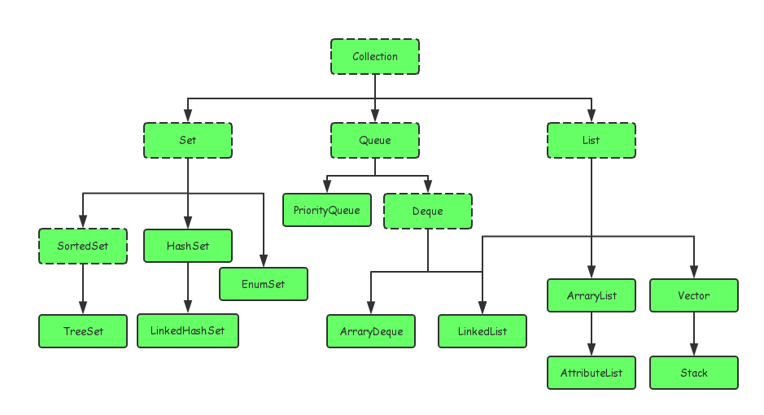

#### Java 集合框架
> Java 的集合大致分为Set、List、Queue、和Map 四种体系，其中Set表示无序不可重复的，
> List 代表有序、重复的集合；Map 表示具有映射关系的集合；Java5中又增加了Queue集合。

#### 集合和数组的区别
> 数组长度在初始化的时候就指定，只能保存定长的数据，而集合可以保存数量不确定的数据，同时保存具有映射
> 关系的数据
>
> 数组元素既可以是基本类型的值，也可以是对象。 集合中只能保存对象(实际上保存对象的引用变量)，
> 基本数据类型的变量要转换为包装类才能放到集合类中
>
#### Java 集合类之间的集成关系
> Java 的集合类主要有两个接口派生而出：Collection 和 Map

 

public class PriorityQueue<E> extends AbstractQueue<E>
    implements java.io.Serializable {
    
public abstract class AbstractQueue<E>
    extends AbstractCollection<E>
    implements Queue<E> {
    
Queue 是一个先进先出FILO 的，队列，保证每次取出的元素都是队列中权值最小的
元素大小的评判可以通过元素本身的自然顺序（natural ordering），也可以通过构造时传入的比较器
PriorityQueue是具有优先级的Queue，它的出队顺序与元素的优先级有关，

对PriorityQueue调用remove()或poll()方法，返回的总是优先级最高的元素。
PriorityQueue 不允许空值，而且不支持 non-comparable（不可比较）的对象，

比如用户自定义的类。优先队列要求使用 Java Comparable 和 Comparator 接口给对象排序，
并且在排序时会按照优先级处理其中的元素。

PriorityQueue 是非线程安全的，所以 Java 提供了 PriorityBlockingQueue（
实现 BlockingQueue接口）用于Java 多线程环境。

通过堆实现，具体说是通过完全二叉树（complete binary tree
每层结点都完全填满）实现的小顶堆（任意一个非叶子节点的权值，都不大于其左右子节点的权值），
也就意味着可以通过数组来作为 PriorityQueue 的底层实现。

存储位置：层次遍历

父子节点的编号之间有如下关系：
    leftNo = parentNo * 2 + 1
    rightNo = parentNo * 2 + 2
    parentNo = (nodeNo - 1) / 2
    

通过上述三个公式，可以轻易计算出某个节点的父节点以及子节点的下标。
这也就是为什么可以直接用数组来存储堆的原因。

   